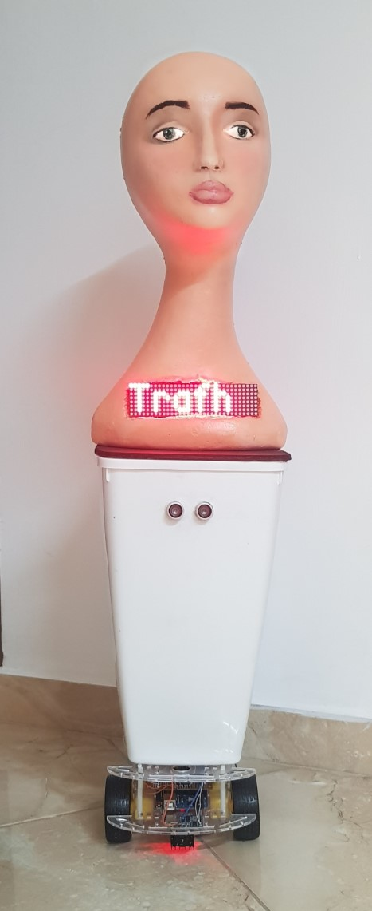
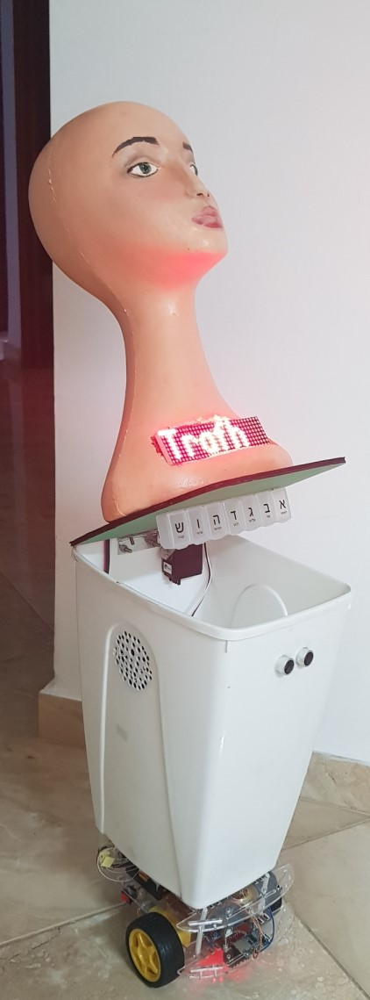

# Trafh
Friendly Robot for Alzheimer and Dementia Patients
TRAFH is a social robot which developed in order to slow down the Alzheimer’s spreading speed and to improve the patient’s quality of life while using basic operations with human’s emotion. 

 

Illustrative Video :

https://drive.google.com/open?id=1VjwwszzUjaxfWp_6RNQG1l4Jh-LoU0IM
